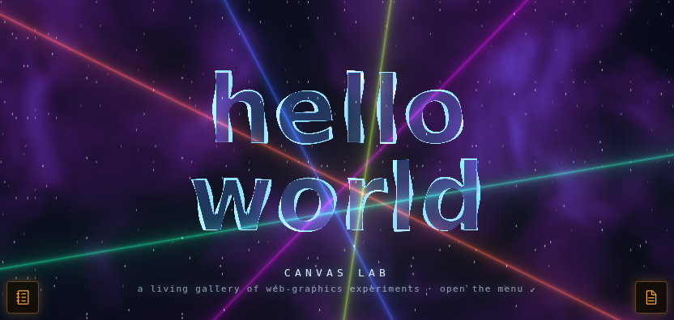
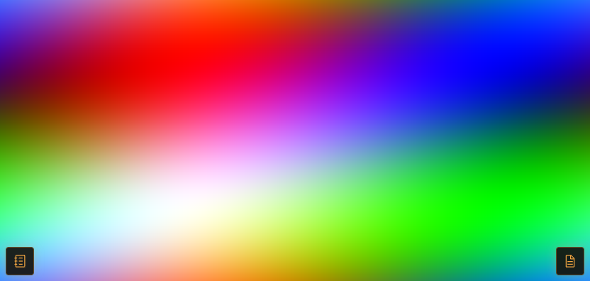
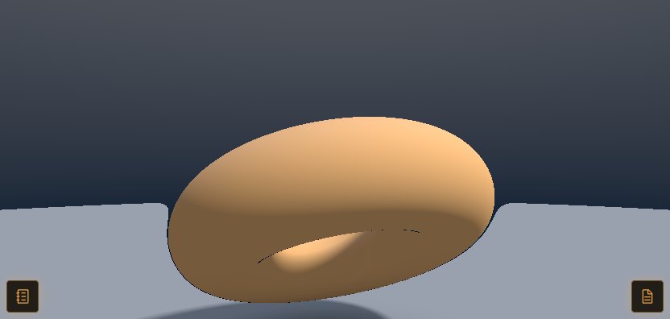
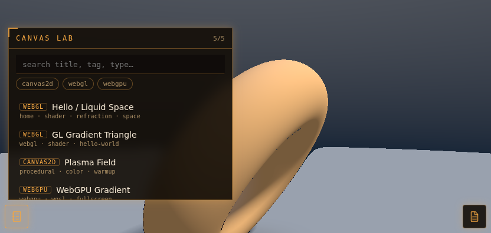
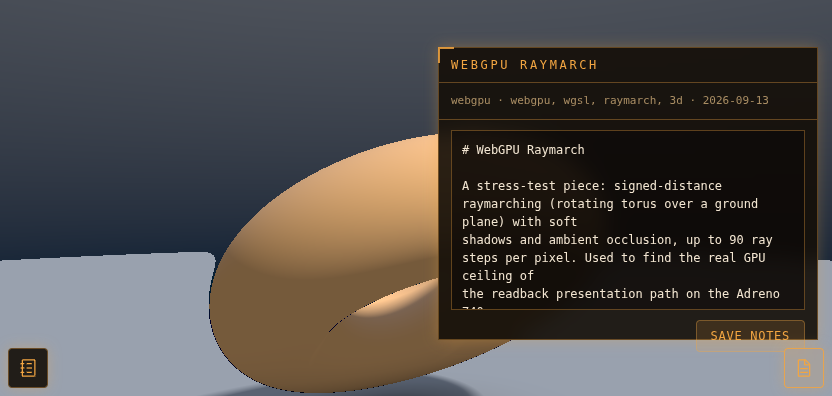

# Canvas Lab

A gallery of self-contained web-graphics pieces — WebGPU, WebGL, Canvas2D, SVG, CSS — with no build step and no dependencies. Drop a folder in `pieces/`, and it shows up.



## What it is

A tiny lab for graphics experiments. Each piece is a single self-contained folder; the server discovers it automatically; you flip between them full-screen and jot notes as you go.

- **No build, no dependencies.** `server.mjs` is plain Node with an empty `node_modules`. It scans `pieces/`, serves the app, and saves per-piece notes.
- **The gallery is automatic.** Every directory under `pieces/` with a `meta.json` becomes an entry — searchable, tag-filtered, sorted with the home piece first.
- **Pieces are self-contained.** One folder = `index.js` + `meta.json` + optional `notes.md`. Nothing shared but a small stage object and, for GPU work, `/gpu.js`.
- **Per-piece notes.** A markdown scratchpad per piece, edited in the browser and written back to `notes.md`.
- **SSE hot reload.** Edit a piece and the stage re-mounts it live; edit the shell and the page reloads. No watcher to run separately.
- **Full-viewport.** Content fills the screen; the launchers overlay it rather than shrinking it.

## The headline: WebGPU on a phone's real GPU

The WebGPU pieces here render on the **actual Adreno 740 GPU** — inside a headless Chromium mirrored onto an Android handheld's top screen — at a steady **60fps**, not on a software rasterizer. That is not the default behavior on this device; Chromium hands the page a CPU adapter and calls it a day.

It works because of the companion project **[turnip-kgsl-shim](https://github.com/MaterDev/turnip-kgsl-shim)**, a ~200-line Vulkan shim (plus a Dawn identity spoof and an `LD_PRELOAD` blocker) that gets the GPU to the page without root or a rebuilt Chromium. The last of its four layers lives here, in `public/gpu.js`. See that repo for the full mechanism and benchmarks.

Because the GPU is deliberately disguised as SwiftShader to satisfy Chromium's decoder, `adapter.info` and `adapter.isFallbackAdapter` **cannot be trusted** — the adapter reports as software on purpose. `gpu.js` handles that for you; never gate your own code on the adapter name or the fallback flag.

## Gallery

| | |
| --- | --- |
|  |  |
| **WebGPU Gradient** — an animated full-screen WGSL fragment shader, running on the GPU. | **WebGPU Raymarch** — a raymarched SDF scene with soft shadows and AO, a heavy per-pixel GPU workload. |

| | |
| --- | --- |
|  |  |
| **Gallery** — search, tag filters, and the piece list, in amber over a live piece. | **Notes** — a markdown scratchpad per piece, saved back to `notes.md`. |

The current set also includes **Hello / Liquid Space** (the home piece above), a raw-WebGL2 **GL Gradient Triangle**, and a Canvas2D **Plasma Field** baseline.

## Run

```
npm start
```

```
http://127.0.0.1:4860/
```

Port 4860 is fixed. The gallery opens on the home piece; tap any entry to load it full-viewport into the stage.

```
npm test
```

runs the app's own smoke test (`test/smoke.mjs`).

## Writing a piece

A piece is `pieces/<id>/index.js` exporting an async `create(stage)`:

```js
export async function create(stage) {
  // ... set up drawing on stage.canvas or stage.container ...
  return {
    resize() {/* re-layout for the new stage size */},
    destroy() {/* free the context, buffers, timers */},
  };
}
```

`stage` gives you `{ container, canvas, width, height, dpr }`:

- `stage.canvas` — a `<canvas>` for 2D / WebGL / WebGPU output.
- `stage.container` — the stage element; append SVG / HTML / DOM here.
- `stage.width` / `stage.height` — CSS-pixel size; `stage.dpr` — device pixel ratio (capped at 2).

Alongside `index.js`, each piece has `meta.json` (`title`, `type`, `tags`, `created`, `description`, optional `home`) and an optional `notes.md`. Scaffold one with:

```
npm run new -- <id> "Title" [type]
```

If a piece can't run (no GPU, lost context), throw from `create` — the gallery catches it and shows an "open in real Chrome" fallback card instead of a black stage.

### WebGPU pieces must use `/gpu.js`

WebGPU pieces do **not** draw to a `webgpu` context — Chromium can't composite one from the disguised adapter, so it renders blank. Use the two helpers from `/gpu.js` instead:

- **`getGPU({ label })`** → `{ device, adapter, desc }`. Requests the adapter and device, and — because the reported name is untrustworthy here — **times a probe to measure real GPU speed** rather than reading the name (which reads "swiftshader" on purpose). A real GPU finishes in a few ms; a genuine CPU rasterizer takes seconds and would freeze the device, so `getGPU()` throws in that case. Let the error propagate to the fallback card.
- **`createPresenter(device, stage)`** → a presenter that owns `stage.canvas` as a **2D** canvas. Each frame, render into `present.begin().view`, then `await present.present()` — it renders offscreen, reads the pixels back, and blits them into the 2D canvas, because the disguised adapter's `webgpu`-context canvas can't be composited. The same path works unchanged on real Chrome.

A minimal WebGPU piece:

```js
import { getGPU, createPresenter } from '/gpu.js';

export async function create(stage) {
  const { device } = await getGPU({ label: 'my-piece' });   // throws -> fallback card
  const present = createPresenter(device, stage);           // owns stage.canvas (2d)

  const pipeline = device.createRenderPipeline({
    layout: 'auto',
    vertex:   { module, entryPoint: 'vs' },
    fragment: { module, entryPoint: 'fs', targets: [{ format: present.format }] },
  });

  let raf;
  function frame() {
    const { encoder, view } = present.begin();              // GPUTextureView to draw into
    const pass = encoder.beginRenderPass({ colorAttachments: [{ view, loadOp: 'clear', storeOp: 'store' }] });
    pass.setPipeline(pipeline); pass.draw(3); pass.end();
    present.present().then(() => { raf = requestAnimationFrame(frame); });  // submit + readback + blit
  }
  raf = requestAnimationFrame(frame);

  return {
    resize()  { present.resize(); },
    destroy() { cancelAnimationFrame(raf); present.destroy(); device.destroy(); },
  };
}
```

Worked, running examples: `pieces/webgpu-gradient/` and `pieces/webgpu-raymarch/`. `gpu.js` also exports `fpsMeter(label)` for a per-frame `tick()` that logs `~N fps` to the console.

## Companion projects

Canvas Lab is one of three pieces designed to work together on the AYN Thor:

- **[turnip-kgsl-shim](https://github.com/MaterDev/turnip-kgsl-shim)** — the runtime layers that put `navigator.gpu` on the real Adreno. The deep dive on *how* the GPU pieces above run at all.
- **[Thor Viewer](https://github.com/MaterDev/thor-viewer)** — the full-screen, on-device mirror of the headless browser. These pieces are watched through it on the handheld's top screen (and open directly in real Chrome too).

## Layout

Pieces stay full-viewport; the app's controls overlay them following `~/.claude/rules/thor-app-layout.md`: amber launchers at **bottom-left** (gallery) and **bottom-right** (notes), matching the Thor Viewer shell's 40px button geometry so app and shell read as one set.

## License

MIT — see [LICENSE](LICENSE).
